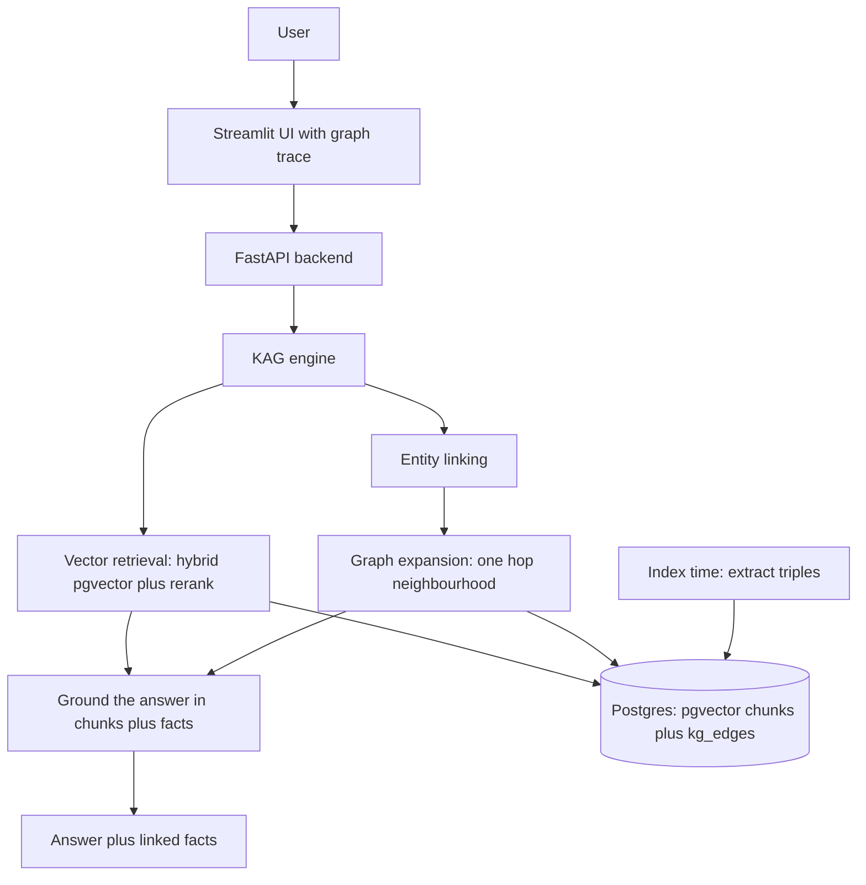

# rag-graph-2024

**Knowledge augmented RAG. A knowledge graph is built from your documents and linked into every answer. Part of the RAG line.**

**Part of the RAG line, a series of reference enterprise RAG implementations. This repository is rag-graph-2024, Knowledge Augmented Generation.** See [the full line](#the-rag_naive-line) below.

rag-graph-2024 retrieves on two channels at once. The vector channel pulls the most similar chunks, as in every earlier implementation. The graph channel links the entities in your question into a knowledge graph extracted from the documents, and pulls their one hop neighbourhood of facts. The answer is grounded in both, and the linked triples are returned with it, so the structured reasoning is visible rather than hidden. It runs fully locally on Ollama at no cost.

[](https://github.com/mlvpatel/rag-graph-2024/actions/workflows/ci.yml)    


The clip above is a live, unedited run on a local model over pgvector. The expandable trace shows the vector retrieval, the entities linked into the graph, and the facts that grounded the answer. A full resolution screenshot is at [assets/screenshots/rag_graph-ui.png](assets/screenshots/rag_graph-ui.png). No paid keys were used.

## What makes it knowledge augmented

A pure vector RAG sees text as a bag of chunks. It cannot follow a relationship, because it never stored one. rag-graph-2024 adds a structured layer:

| Stage | What happens |
|---|---|
| Extract | At index time, a local model reads each chunk and extracts subject, predicate, object triples, the facts the text states |
| Store | Triples are stored as edges in Postgres, next to the pgvector chunks, so no extra service is needed |
| Link | At answer time, the question's entities are matched against the graph, case insensitively, so "Acme" links to "Acme Corporation" |
| Expand | The one hop neighbourhood of those entities is pulled in as explicit facts |
| Ground | The answer is grounded in both the chunks and the facts, and the facts are returned as the trace |

If the graph has nothing to add, the engine degrades gracefully to the vector channel alone, so it always answers.

## How a question is answered

The question runs through the vector retriever to gather the most similar chunks. In parallel, its entities are extracted and matched into the knowledge graph, and their connected facts are pulled in. The answer is generated from both, using only what was retrieved. On a question the documents do not cover, neither channel returns the fact, and the model answers honestly that it does not have the information rather than inventing one.

## Features

| Area | Capability |
|---|---|
| Knowledge graph | Subject, predicate, object triples extracted from documents at index time |
| Dual retrieval | Dense pgvector chunks plus one hop graph expansion, grounded together |
| Entity linking | Case insensitive, substring aware matching of question entities to graph nodes |
| Retrieval | Dense pgvector plus sparse Postgres full text, fused with RRF in one SQL query |
| Reranking | Cross encoder bge-reranker-v2-m3 |
| Models | OpenAI, Anthropic, or local Ollama, chosen by model name |
| Grounded first | Answers strictly from your documents and their graph |
| Observability | The linked entities and the facts used are returned and shown in the UI |
| Memory | Multi turn sessions stored in Postgres |
| Security | API key auth, rate limiting, input sanitization, CORS |
| Packaging | Docker Compose, Prometheus metrics, tests, CI |

## Architecture



## How to use

### Local, fully offline with Ollama (no paid keys)

```bash
# 1. Data services
make db-up             # postgres with pgvector, plus redis

# 2. Ollama and the local models
ollama serve &
ollama pull nomic-embed-text
ollama pull qwen2.5:7b-instruct

# 3. Install and run
make install
EMBEDDING_PROVIDER=ollama make dev        # API on :8000
make frontend                             # UI on :8501, second terminal
```

The extraction model is `qwen2.5:7b-instruct` by default, a reliable local model for structured triple extraction. Ask a question and open the trace under the answer to see which facts the graph contributed.

## Try it with the bundled sample data

The repo ships sample documents in [sample_data](sample_data), an HR handbook, a product FAQ, and a real SEC 10-K excerpt. With the stack up:

```bash
make load-samples
```

Loading extracts the knowledge graph as well as the vectors, so the first load does real model work. Then ask the questions in [sample_data/README.md](sample_data/README.md), including an honesty check where the system should decline rather than guess.

## Configuration

| Setting | Default | Meaning |
|---|---|---|
| EMBEDDING_PROVIDER | google | google or ollama |
| KAG_EXTRACT_MODEL | qwen2.5:7b-instruct | the local model that extracts triples and links entities |
| KAG_NEIGHBOR_LIMIT | 20 | cap on facts one question can pull from the graph |
| API_KEY | change_me | required in the X-API-Key header |

## API reference

| Method and path | Purpose |
|---|---|
| GET /health | Liveness, no auth |
| POST /v1/chat | Knowledge augmented answer with the linked entities and facts |
| POST /v1/upload-doc | Upload and asynchronously index a document, building its graph |
| GET /v1/list-docs | List indexed documents |
| POST /v1/delete-doc | Delete a document, its chunks, and its graph edges |
| GET /metrics | Prometheus metrics |

## Testing

```bash
make test        # unit tests, no database or model needed
```

Unit tests cover the extraction parsing, the API contract, retrieval, and config, with the model and database mocked. Integration tests run against the live stack.

## Project structure

```
src/kag/          the knowledge graph: store, extraction, engine
src/api/          FastAPI app, endpoints, security, Postgres memory
src/core/         config, retrieval chain helpers, logging
src/embeddings/   pgvector store and embedding providers
src/retrieval/    hybrid retriever and reranker
frontend/         Streamlit UI with the graph trace
sample_data/      runnable sample documents
tests/            unit and integration tests
docker/           Dockerfile and Compose stack
```

## The RAG line

This repo is the Graph (2024) rung. Each rung adds one idea and keeps the ones below it.

| Year | Repository | Strategy |
|---|---|---|
| 2022 | [rag-naive-2022](https://github.com/mlvpatel/rag-naive-2022) | Naive: one dense search over Chroma |
| 2023 | [rag-advanced-2023](https://github.com/mlvpatel/rag-advanced-2023) | Advanced: hybrid, RRF and cross encoder, in Python |
| 2023 | [rag-modular-2023](https://github.com/mlvpatel/rag-modular-2023) | Modular: pgvector, RRF in SQL, streaming, memory, evaluation |
| 2024 | rag-graph-2024, this repo | Graph: entity and triple knowledge graph linked into answers |
| 2024 | [rag-cache-2024](https://github.com/mlvpatel/rag-cache-2024) | Cache: no retrieval, corpus in context with a semantic cache |
| 2025 | [rag-agentic-2025](https://github.com/mlvpatel/rag-agentic-2025) | Agentic: bounded self correcting loop, confidence gated |
| 2026 | [rag-multiagent-2026](https://github.com/mlvpatel/rag-multiagent-2026) | Multi agent: supervisor, specialists, verifier |
| 2026 | [rag-multimodal-2026](https://github.com/mlvpatel/rag-multimodal-2026) | Multimodal: text and images in one vector space |

## Author

Malav Patel. GitHub @mlvpatel.

## License

Released under the MIT License. See [LICENSE](LICENSE). MIT is the simplest and most permissive of the common licenses, so anyone can read, run, modify, and reuse the code freely.
