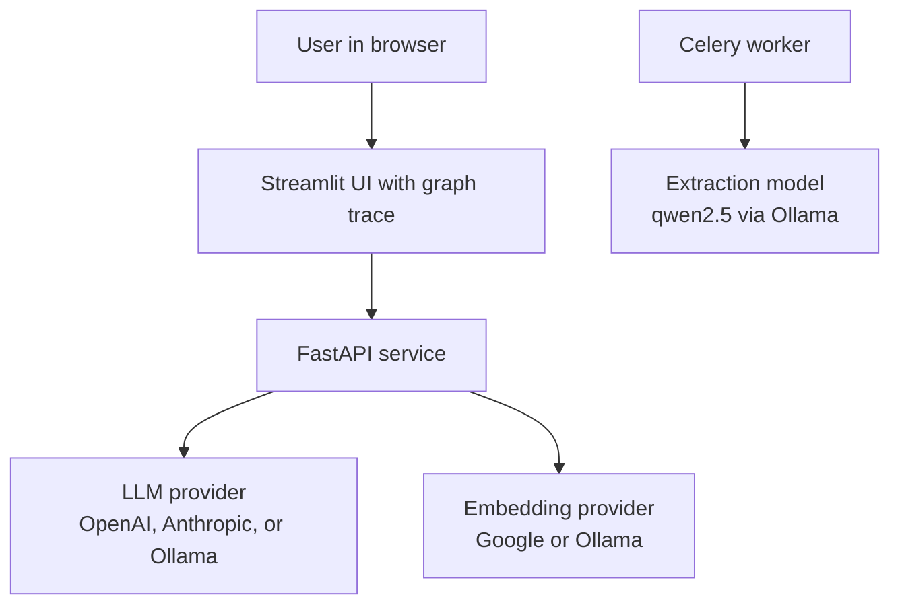
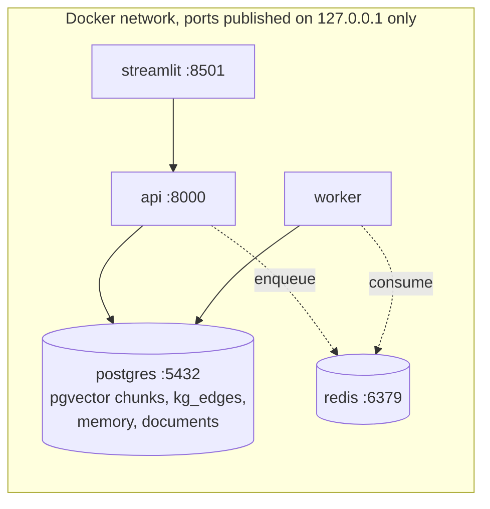
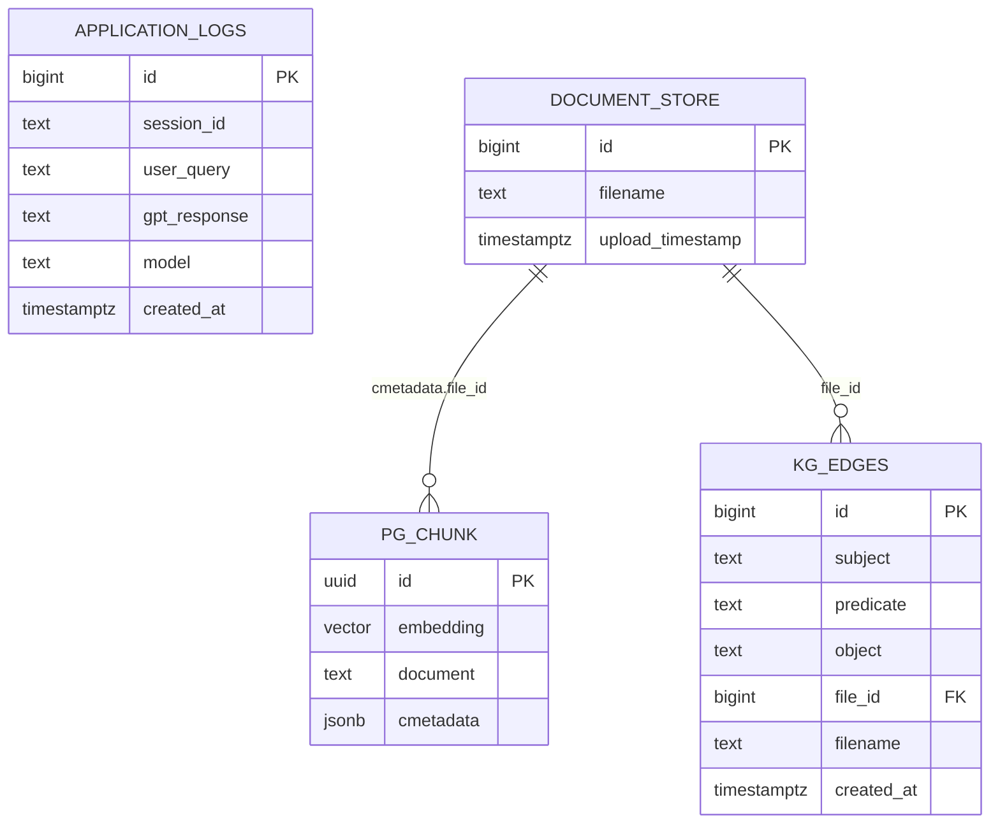
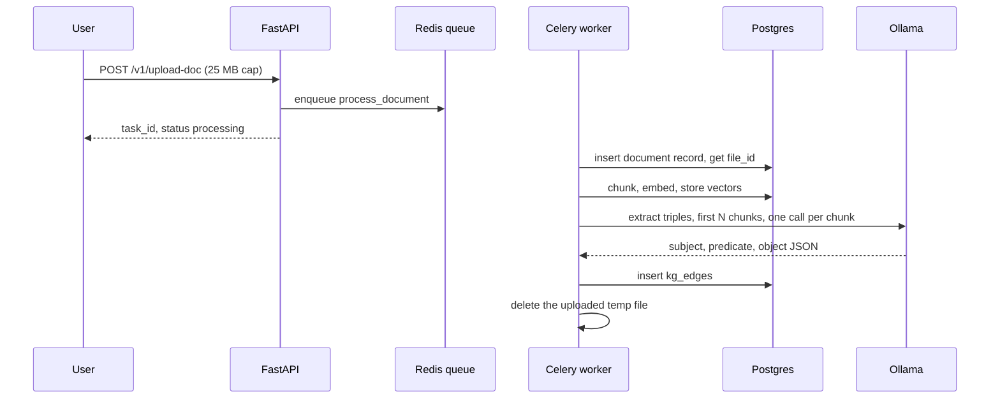
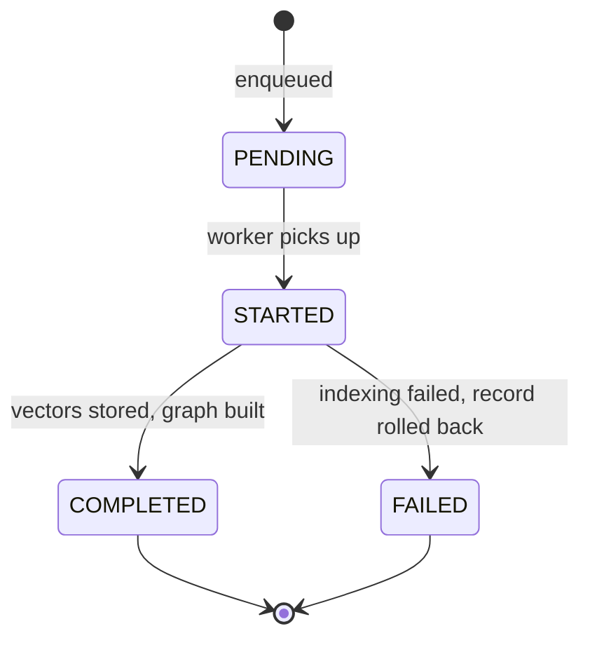
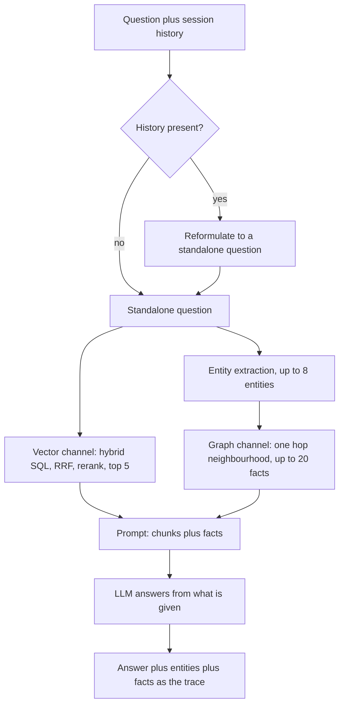
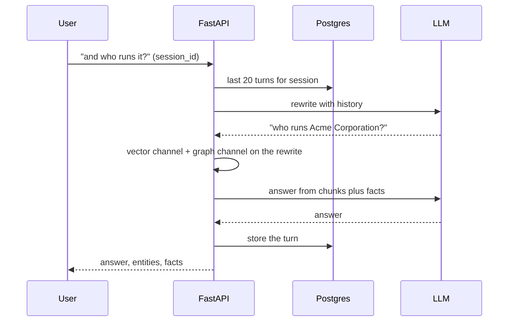

# rag-graph-2024

**Knowledge augmented RAG: a knowledge graph of entities and triples is built from your documents at index time and linked into every answer. The Graph (2024) rung of the RAG line.**

Part of the RAG line, a series of reference enterprise RAG implementations, one per retrieval strategy. This repository is the Graph (2024) rung. See [the full line](#the-rag-line) below.

[](https://github.com/mlvpatel/rag-graph-2024/actions/workflows/ci.yml)    


The clip above is a live, unedited run on a local model over pgvector. The expandable trace shows the vector retrieval, the entities linked into the graph, and the facts that grounded the answer. A full resolution screenshot is at [assets/screenshots/rag-graph-2024-ui.png](assets/screenshots/rag-graph-2024-ui.png). No paid keys were used.

## Contents

- [What makes it knowledge augmented](#what-makes-it-knowledge-augmented)
- [Tech stack](#tech-stack)
- [Architecture](#architecture)
- [Data model](#data-model)
- [How ingestion works](#how-ingestion-works)
- [How a question is answered](#how-a-question-is-answered)
- [Memory](#memory)
- [The mathematics](#the-mathematics)
- [How to use](#how-to-use)
- [Configuration](#configuration)
- [API reference](#api-reference)
- [A note on access](#a-note-on-access)
- [Testing](#testing)
- [Project structure](#project-structure)
- [The RAG line](#the-rag-line)

## What makes it knowledge augmented

A pure vector RAG sees text as a bag of chunks. It cannot follow a relationship, because it never stored one. Ask "who runs the company that makes Nimbus?" and similarity search must hope some single chunk happens to contain the whole chain. This rung stores the relationships explicitly:

| Stage | What happens |
|---|---|
| Extract | At index time, a local model reads each chunk and emits subject, predicate, object triples, the facts the text states |
| Store | Triples are stored as edges in Postgres, next to the pgvector chunks, so no extra service is needed |
| Link | At answer time, the question's entities are matched against the graph, case insensitively and substring aware, so "Acme" links to "Acme Corporation" |
| Expand | The one hop neighbourhood of those entities is pulled in as explicit facts |
| Ground | The answer is grounded in both the chunks and the facts, and the facts are returned as the trace |

If the graph has nothing to add, the engine degrades gracefully to the vector channel alone, so it always answers.

Two honest limits, stated because they shape what the graph can do: extraction covers the first `KAG_MAX_CHUNKS` chunks of each document (one model call per chunk is the cost, and the cap is the price control, raise it for long documents), and the two channels are merged by giving the model both, not by cross ranking them against each other.

## Tech stack

| Component | Choice | Why this one |
|---|---|---|
| API | FastAPI | Async, typed, OpenAPI for free |
| Vector store | pgvector on Postgres 16 | Chunks, memory, and the graph in one database |
| Sparse retrieval | Postgres full text (ts_rank) | Computed inside the database, no per query rebuild |
| Fusion | RRF in one SQL query | Both channels ranked and fused where the data lives |
| Reranker | BAAI/bge-reranker-v2-m3 | Strong multilingual cross encoder, lazy loaded |
| Graph store | A single kg_edges table | Triples need no graph database at this scale; trigram indexes serve the matching |
| Triple extraction | qwen2.5:7b-instruct via Ollama | Reliable local structured extraction, keyless |
| Embeddings | Google gemini-embedding-001 or Ollama nomic-embed-text | Asymmetric task types on Google; Ollama for a fully local run |
| Generation | OpenAI, Anthropic, or Ollama | Routed by model name |
| Memory | Postgres | Same instance, windowed history |
| Ingestion | Celery + Redis | Uploads return immediately; extraction happens in the worker |
| UI | Streamlit | Chat surface with an expandable graph trace |
| CI | GitHub Actions | Lint, unit tests, pip-audit with no suppressions |

## Architecture

System context:



Containers: everything persistent lives in one Postgres.



## Data model



Both the chunks and the graph edges carry the document's `file_id`, so deleting a document removes its vectors and its triples in the same request.

## How ingestion works



Vector indexing and graph building are ordered on purpose: the graph is best effort, so a failed extraction never blocks the vectors that already landed, and a failed vector index rolls the document record back.

Task lifecycle:



## How a question is answered



On a question the documents do not cover, neither channel returns the fact and the model says it does not have the information rather than inventing one.

## Memory

Turns are stored per `session_id` in Postgres, windowed to the last 20 turns. With history present, the question is first rewritten into a standalone query, and retrieval, entity linking, and the answer all work on that, so a follow-up pronoun never reaches the graph matcher.



## The mathematics

**The graph.** Each document contributes a set of triples $(s, p, o)$, at most 12 per chunk, extracted by a local model. The graph is the union of all triples; nodes are implicit (any string appearing as subject or object). For a question with extracted entities $E$ (at most 8), the graph channel returns the one hop neighbourhood

$$N(E) = \{ (s, p, o) : \exists e \in E,\; e \sqsubseteq s \;\lor\; e \sqsubseteq o \}$$

where $\sqsubseteq$ is case insensitive substring containment, capped at 20 edges. Substring matching is what lets "Acme" link to "Acme Corporation"; the trigram GIN indexes are what make that affordable, because a btree can never serve a leading wildcard.

**Dense channel.** pgvector's `<=>` operator is cosine distance:

$$d_{\cos}(\mathbf{a}, \mathbf{b}) = 1 - \frac{\mathbf{a} \cdot \mathbf{b}}{\lVert \mathbf{a} \rVert\,\lVert \mathbf{b} \rVert}$$

so 0 is identical and ascending order ranks the nearest chunk first. The embeddings are asymmetric: $f_D$ (`retrieval_document`) at index time and $f_Q$ (`retrieval_query`) at query time, trained so $\text{sim}(f_Q(q), f_D(d))$ is high when $d$ answers $q$, not when the texts merely look alike.

**Sparse channel.** Postgres scores each document against the query with `ts_rank`, which weights matched lexeme frequency and proximity. Only the rank order is used downstream, never the raw value.

**Fusion, inside SQL.** Each channel keeps a pool of 20 candidates ranked by `row_number()` (1-based). A chunk at rank $r$ contributes

$$\text{RRF}(d) = \frac{1}{k + r_{\text{dense}}} + \frac{1}{k + r_{\text{sparse}}}, \qquad k = 60$$

with a missing rank contributing 0 via the full outer join. The damping constant makes rank 1 worth $\tfrac{1}{61}$ and rank 2 worth $\tfrac{1}{62}$, so a chunk both channels agree on ($\tfrac{1}{62} + \tfrac{1}{62}$) beats a chunk only one channel loved ($\tfrac{1}{61}$). Ranks need no calibration between a distance and a text score, which is why RRF fuses them safely.

**Rerank.** A cross encoder reads each (question, chunk) pair jointly, $s(q, d) = g([q\,;\,d])$, and keeps the top 5 of the fused pool. It is too slow to run over a corpus and exactly fast enough to run over 20 candidates.

**Grounding.** The final prompt is the union of the two channels: top 5 chunks as context, up to 20 triples as facts. There is deliberately no cross channel score: a fact and a chunk are different kinds of evidence, and the model is told to use only what is given.

**Chunking.** With chunk size $c = 1000$ and overlap $o = 200$, a document of length $L$ yields about $n \approx \lceil (L - o) / (c - o) \rceil$ chunks; graph extraction covers the first $\min(n, \text{KAG\_MAX\_CHUNKS})$ of them.

## How to use

### Local, fully offline with Ollama (no paid keys)

```bash
# 1. Data services
make db-up             # postgres with pgvector and pg_trgm, plus redis

# 2. Ollama and the local models
ollama serve &
ollama pull nomic-embed-text
ollama pull qwen2.5:7b-instruct

# 3. Install and run
make install
EMBEDDING_PROVIDER=ollama make dev        # API on :8000
make frontend                             # UI on :8501, second terminal
```

The extraction model is `qwen2.5:7b-instruct` by default, a reliable local model for structured triple extraction. Ask a question and open the trace under the answer to see which facts the graph contributed.

### Try it with the bundled sample data

The repo ships sample documents in [sample_data](sample_data), an HR handbook, a product FAQ, and a real SEC 10-K excerpt. With the stack up:

```bash
make load-samples
```

Loading extracts the knowledge graph as well as the vectors, so the first load does real model work. Then ask the questions in [sample_data/README.md](sample_data/README.md), including an honesty check where the system should decline rather than guess.

## Configuration

| Setting | Default | Meaning |
|---|---|---|
| EMBEDDING_PROVIDER | google | google or ollama |
| KAG_EXTRACT_MODEL | qwen2.5:7b-instruct | The local model that extracts triples and links entities |
| KAG_NEIGHBOR_LIMIT | 20 | Cap on facts one question can pull from the graph |
| KAG_MAX_CHUNKS | 10 | Chunks per document covered by graph extraction |
| TOP_K / RERANKER_TOP_N | 5 / 5 | Final chunk counts per stage |
| USE_RERANKER | true | Disable to skip the cross encoder |
| CHUNK_SIZE / CHUNK_OVERLAP | 1000 / 200 | Chunking parameters |
| MAX_UPLOAD_MB | 25 | Uploads rejected above this size |
| ALLOWED_ORIGINS | http://localhost:8501 | CORS allowlist |

## API reference

| Method and path | Purpose | Limit |
|---|---|---|
| GET /health | Liveness | none |
| GET /metrics | Prometheus metrics | none |
| POST /v1/chat | Knowledge augmented answer with entities and facts | 60/min |
| POST /v1/upload-doc | Upload, queue indexing and graph build | 10/min, 25 MB |
| GET /v1/task/{task_id} | Poll indexing status | none |
| GET /v1/list-docs | List indexed documents | none |
| POST /v1/delete-doc | Delete a document, its chunks, and its edges | none |

## A note on access

The service has no authentication, and that is a decision rather than an omission. It is a reference implementation meant to run on one machine: docker compose binds every published port, Postgres and Redis included, to `127.0.0.1`, and the containers run as a non-root user. A shipped default credential would be the worse option, since it reads as protection while sitting in a public repository. What remains is real: per route rate limiting, a hard size cap on uploads, HTML stripping on every question, and a narrow CORS origin. Put an authenticating gateway in front before exposing any of it beyond loopback.

## Testing

```bash
make test        # unit tests, no database or model needed
```

Unit tests cover the extraction parsing, the standalone question wiring (a follow-up with history must reach retrieval and entity linking already rewritten), the windowed history query, retrieval and rerank ordering, the API contract without credentials, and worker rollback ordering, all with the model and database mocked. Integration tests run the real engine against a live Postgres and Ollama when those are reachable, and skip otherwise. A small retrieval evaluation harness lives in [eval](eval).

## Project structure

```
src/kag/          the knowledge graph: store, extraction, engine
src/api/          FastAPI app, endpoints, Postgres memory
src/core/         config, chain helpers, logging
src/embeddings/   pgvector store and embedding providers
src/retrieval/    hybrid retriever and reranker
src/worker/       Celery app and the indexing task
eval/             golden questions and retrieval metrics
frontend/         Streamlit UI with the graph trace
sample_data/      runnable sample documents
tests/            unit and integration tests
docker/           Dockerfile and Compose stack
```

## The RAG line

This repo is the Graph (2024) rung. Each rung adds one idea and keeps the ones below it.

| Year | Repository | Strategy |
|---|---|---|
| 2022 | [rag-naive-2022](https://github.com/mlvpatel/rag-naive-2022) | Naive: one dense search over Chroma |
| 2023 | [rag-advanced-2023](https://github.com/mlvpatel/rag-advanced-2023) | Advanced: hybrid, RRF and cross encoder, in Python |
| 2023 | [rag-modular-2023](https://github.com/mlvpatel/rag-modular-2023) | Modular: pgvector, RRF in SQL, streaming, memory, evaluation |
| 2024 | rag-graph-2024, this repo | Graph: entity and triple knowledge graph linked into answers |
| 2024 | [rag-cache-2024](https://github.com/mlvpatel/rag-cache-2024) | Cache: no retrieval, corpus in context with a semantic cache |
| 2025 | [rag-agentic-2025](https://github.com/mlvpatel/rag-agentic-2025) | Agentic: bounded self correcting loop, confidence gated |
| 2026 | [rag-multiagent-2026](https://github.com/mlvpatel/rag-multiagent-2026) | Multi agent: supervisor, specialists, verifier |
| 2026 | [rag-multimodal-2026](https://github.com/mlvpatel/rag-multimodal-2026) | Multimodal: text and images in one vector space |

## Author

Malav Patel. GitHub [@mlvpatel](https://github.com/mlvpatel).

## License

Released under the MIT License. See [LICENSE](LICENSE).
